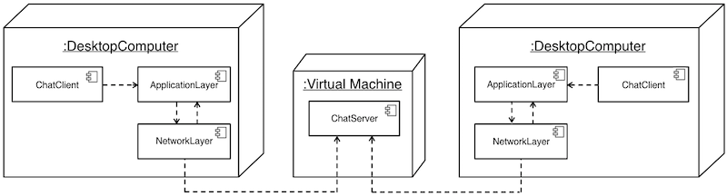
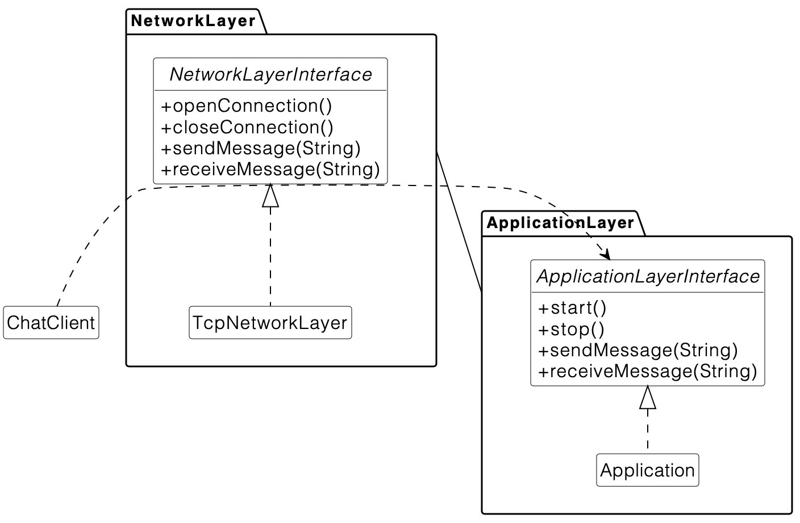
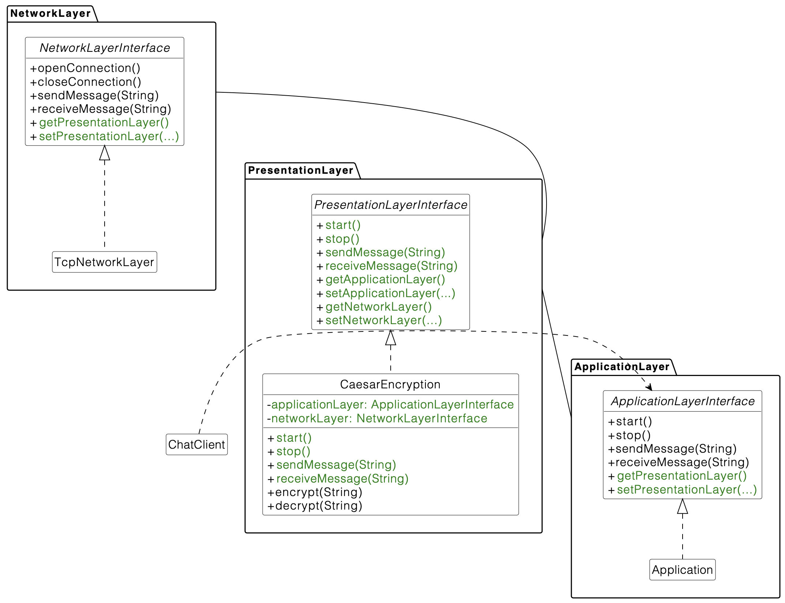

### Layered Architecture in a chat system
We want to add a chat system to the University Application. Students should be able to chat with their friends. We use a layered architecture for the chat system. Our chat server is running on a virtual machine and the exercise template is already configured for that. This exercise is based on the results of the group exercise G05E01 from the tutor groups. After modeling the system (see the UML deployment diagram below), it is now your task to implement the chat client and to improve it according to a change request. First, clone the project and import it into your IDE.

The following architecture of the chat client is given which consists of 2 layers:

* Layer 1: Application Layer
* Layer 0: Network Layer

Please note: There are TODO comments in the exercise code. These comments give helpful hints for solving this exercise! Make sure to follow the instructions precisely, otherwise the test cases might have compile/build errors and your result will be 0%.

You should also pay attention to your code style, as it will be graded by Artemis in this exercise (and in upcoming exercises as well). The goal is to write clean code with the hints that Artemis directly provides along with the task results. You can find the warnings both inside the online code editor and in the feedback list of your submission's result.

#### Part 1: Getting familiar with the application
In the first part, we want to get familiar with the existing application and present messages on the Chat Client.

You have the following tasks:
1. Use the applicationLayer to send messages from the ChatClient.
2. The ChatClient should print out received messages on the console.
3. Upon arrival of a new message, the ChatClient must be notified by the Application class (which implements the ApplicationLayerInterface).
4. Debug the chat system by setting a breakpoint in the openConnection() method in the TcpNetworkLayer. Run the main method in ChatClient. Inspect the stack trace to understand the different layers and how they are connected.
5. Debug the chat system by setting a breakpoint in the sendMessage(...) method in the TcpNetworkLayer. Run the main method in ChatClient. Inspect the stack trace to understand the different layers and how they are connected. You need to write some text (user input) into the console so that the text is sent to the chat server.

The following UML class diagram shows the resulting structure after Part 1. Note that components are realized with Java packages.

#### Part 3: Replace Encryption
In the third part, we want to review one of the benefits of the closed layered architecture. The CaesarEncryption is not suitable because our chat server does not support Caesar, it only supports AES. Therefore, we want to replace the used presentation layer implementation with a different encryption.

You have the following tasks:

1. Make sure the existing class AesEncryption conforms to the PresentationLayerInterface (see Part for details how to achieve this)

2. Open and close the connection in the network layer in AesEncryption
(see Part 2 for details how to achieve this)

3. Encrypt and decrypt messages in AesEncryption
(see Part 2 for details how to achieve this)

4. Replace PresentationLayer: Replace CaesarEncryption by the AesEncryption as the used implementation of the PresentationLayerInterface in the ChatClient.
Use 0123456701234567 as key: new AesEncryption("0123456701234567");

5. Send a message to chat. If everything is working right, other students connected to the chat server will see your message now. You can also start a second chat and check if your sent message arrives there.

The following UML class diagram shows the resulting structure after Part 3. Note that components are realized with Java packages and that methods are omitted to improve the readability. There is one notable change. CaesarEncryption was replaced with AesEncryption.

