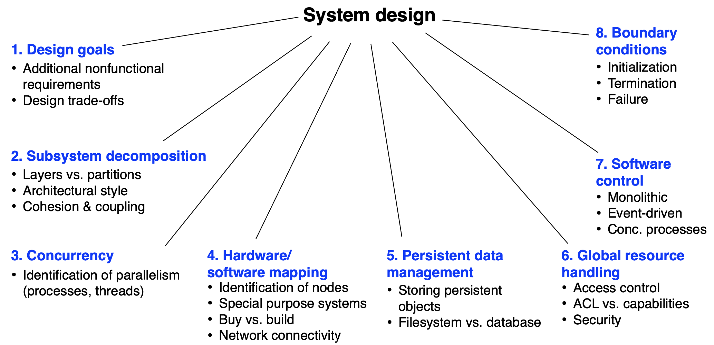
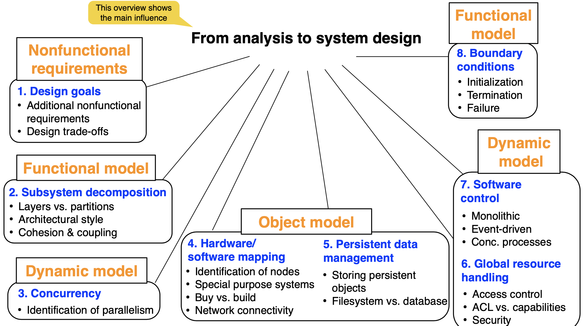

#### The scope of system design
 - Bridge the gap between a problem and an existing system in a manageable way Problem
 - How?
   - Use divide & conquer
   - Identify design goals
   - Model the new system design as a set of subsystems
   - Address the major design goals first
   
#### System design: 8 issues:

#### Main influence of requirements analysis artifacts to system design:

 
 

#### Coupling and Cohesion
Explain the difference between coupling and cohesion. Why are these terms important in system design? Provide an example.

*Requirement: Use your own words and your own example and do not just copy the lecture slides nor internet sources! Limit yourself to around 250 words*

##### My understanding is as follows:

> Coupling measures dependency between different subsystems. High coupling is for the situation where subsystems are related to each other via many associations. So in the high coupling, a change to one subsystem will affect other subsystems.

> A good system design should have low coupling because the developer may often change some implementations in one subsystem but does not want to change other ones.

> Cohesion measures dependency between classes within one subsystem. High cohesion means that the classes are often associated with each other. A good system design should achieve high cohesion.  The classes that perform similar tasks or classes that often call each other should be moved into one subsystem, otherwise for example class A  in Subsystem 1 cannot call class B in Subsystem 2 if changes happen to class B. Put A and B together is more practical and easier to adjust to changes.     

> Example: The Driver subsystem can call all classes in the Vehicle subsystem, including class Engine, Radio, Brake, and Battery.  This indicates high coupling between the two mentioned subsystems. And within the Vehicle subsystem, there is only one association between engine and battery, which implies low cohesion. So this is a bad system design. 

 
 

#### Analysis Model & System Design
Explain in your own words how analysis models influence system design issues and make sure to mention several different aspects. Additionally, describe 5 examples from either your own experience or from Bumpers for at least five design issues.

*Hint: Please limit your answer to max. 250 words.*

##### My understanding is as follows:
> The dynamic model can help to identify parallelism.   For example, in the university course app, students can start and register for a course. the method start() and register() can concurrently happen, at least it's the case at TUM. It might not be so clear without a communication diagram.  With the dynamic model, it will be easier to implement the course app. The dynamic model can also help to handle global access.   Every time an object of a class is accessed, the access list is checked for the corresponding actor and operation. 

> The object model can help to identify nodes in hardware-software mapping. For example, the object model of the Bumpers game describes the association between MouseSteering and GameBoardUI which are mapped to the physical connection between the player's mouse and the game app on his computer. 

> The object model can help to store persistent data objects. For example, in the university app, students can register for multiple courses and one course can have many students. In the object model, this is reflected by a many-to-many association between Student and Course. So the instances of Student and Course can be mapped to a Student_Course table with one column for each.

