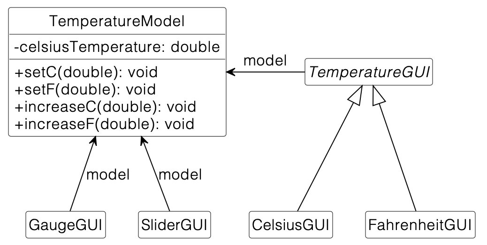

### Facade Pattern
The Facade Pattern reduces the coupling of subsystems by encapsulating the functionality of a complex subsystem. A Facade hides implementation details and only exposes the desired functionality in an easily accessible way to the client.

#### Problem Statement
The COVID-19 pandemic forces local stores to digitalize their business. The new startup ECommerce has had the idea to offer infrastructure, handling the ordering and shipping process. Due to a Cinema being one of the first customers, the startup also takes care of playing and creating advertisements. Your friend Bob works at ECommerce, and when you heard they were looking for developers, you immediately signed up as a working student.

#### Your Task
Currently, stores can access functionalities they should not be able to access. Furthermore, some clients are overwhelmed with the controller system. Your first task as a new employee of the ECommerce company is to resolve this issue by refactoring Bob's code and introducing the facade pattern. Implement the facade according to the UML diagram below that Bob has prepared for you.

You have the following tasks:

1. Introduce the Facade        
Add a new class called ECommerceFacade to your project. In this class, you will in the following implement the methods of the facade.
2.  Implement the Facade    
2.1 Implement all the public methods from the classes OrderController and AdvertisementController in the facade by delegating their functionality to the respective controller methods. Make sure that each controller is initialized in the default constructor.   
2.2 Implement a new shipOrder method which receives an order and an address as parameters. Use the createShipping method of the ShippingController to create the shipping for the passed arguments. Make sure to set the shipping of the passed order before calling shipOrder on the ShippingController.

3. Reduce the coupling  
Remove the associations between Cinema and OrderController, ShippingController and AdvertisementController. The same applies to OrderController, ShippingController and BookStore.
Add associations to the ECommerceFacade in the classes of the package store and implement the functionality in these classes by invoking methods on the ECommerceFacade.

__UML Diagram__

 

### Bridge Pattern
The Bridge Pattern is a structural design pattern that allows you to organize a set of closely related classes into two separate hierarchies - abstraction and implementation - which can be developed independently of each other.

#### Problem Statement:
You work with a student team for the company MyOnlineExam24. For a new online exam system, your team has developed a secure hash algorithm to hash submissions of students ensuring students do not change their submission after the submission deadline.

Universities want to test the functionality of the exam system before using it and have different requirements for hashing normal homework than for hashing exams. Therefore, the system needs to provide an easy way to exchange the two already implemented hash algorithms SimpleHashAlgorithm and CryptoSecureHashAlgorithm.

**Current UML Diagram**

#### Your Task:
Your task is to refactor the system, making it easier to switch the Hashing implementations. Introduce the bridge pattern to offer two versions of the application: PreviewHashing, a free version to test the functionality, and EnterpriseHashing, which provides the full functionality.

You have the following tasks:

1. Implement the new abstract class Hashing to add hashing algorithms independently of the application domain.

2. Introduce a new subclass PreviewHashing of Hashing that uses SimpleHashAlgorithm according to the given UML diagram below. 
If the exam is too large (length over 1000), throw an IllegalArgumentException to ensure the preview version is not used for real exams.

3. Introduce a new subclass EnterpriseHashing of Hashing that uses the CryptoSecureHashAlgorithm according to the given UML diagram below.

4. Adapt the ExamSystem according to the changes made in task 1 to 3. ExamSystem is supposed to use Hashing rather than HashFunction directly. Adapt the method hashFile accordingly and set the hashGenerator properly before hashing files.

5. Before hashing exams, they need to be loaded by the ExamSystem. Your fellow student Bob has already taken care of retrieving the path for an exam. It is your task to read the file and return its content as String. Catch exceptions that may occur during reading the file and throw a RuntimeException with a descriptive error message.
Hint: The class java.nio.file.Files might be helpful!

**UML Diagram**

 

### Composite Pattern
The Composite Pattern is a structural design pattern used to compose objects into tree structures and then work with these structures as if they were individual objects.

#### Problem Statement
You work for the up-and-coming startup CodeSelect. Since the company is currently hiring many new employees, your boss asks you to develop a minimal program to visualize the employee hierarchy. Luckily, your boss has already designed the proposed system in UML using the Composite Pattern. Implement the proposed system according to the provided UML diagram in Java. 
The employee overview system consists of employees. These employees can either be a worker or a supervisor, who supervises a list of multiple other employees. 

Hint: There are TODO comments in the provided template. These comments give hints for solving this exercise!

#### Follow the following tasks:

1. Implement Worker as described in the UML diagram below. The concrete functionality of the list method will be implemented in Task 3.

2. Implement Supervisor as described in the UML diagram below. When implementing dependencies, make sure to implement appropriate getter methods as well. The concrete functionality of the list method will be implemented in Task 3.

3. The employee hierarchy starts with the highest supervisor with level 0. In each hierarchy, this level is increased by 1. 
When list(level) is called in Supervisor, printName(level) must be invoked before calling list(level + 1) on all supervisedEmployees. 
In Worker, only printName(level) must be invoked. If you want to test the functionality of your implementation locally, you can uncomment the code in the EmployeeOverviewSystem class.

**UML Diagram**

 

### Observer Pattern
The observer pattern is a common pattern in software engineering. It is especially important in combination with MVC (Model-View-Controller). In this context, the different subjects (sometimes also referred to as observables) are part of the controller. The view then observes the different subjects and refreshes the UI whenever the observed subject changes. It is also common practice not to have the model expose the mutability of the subject to the view but to provide public setters to the view which will update the state of the subject within the controller. The main advantage of this pattern is the consistency created by having the values only saved once in a central place.

#### Problem Statement:
The university wants a new thermometer for the lecture hall HS01. Because they are currently very busy, they delegated this important task to their talented EIST students. Your task now is to finish the code they've already written. Because the students are multinational, both the standard temperature systems like Celsius and Kelvin but also Fahrenheit need to be supported. As multiple temperature displays need to be installed in the lecture hall, the observer pattern is a perfect fit for this purpose.

The existing source code already provides the following structure to implement observers:

There is an abstract class Subject and an interface Observer.

The class TemperatureModel stores the temperature in Celsius. The conversion between the different units is done by the TemperatureConverter. In addition, there are 4 concrete views CelsiusGUI, FahrenheitGUI, GaugeGUI, and SliderGUI that visualize the temperature in different ways. Notice that TemperatureGUI is an abstract class with 2 concrete subclasses.

(For simplicity reasons, the diagram omits the methods of the different GUI classes.)

Make yourself familiar with these classes. Run the application by executing the main(...) method of the class TemperatureApplication and try out the different views of the model. Notice, that the views do not work at the moment.

#### Part 1: Connect model and views using the Observer Pattern
1. Start by finalizing the implementation of the observer pattern. The Subject has a notifyObservers()-methods that isn't implemented yet. Iterate through all subscribed observers and call onUpdate(Double) on them with the updated state.

2. Make TemperatureModel observable by extending Subject. Notify the observers of TemperatureModel when the temperature changes by using the corresponding method.

3. Also implement the onUpdate(Double) method in GaugeGUI. The TODO-Comments in the code explain in detail how this method should work. You can use the method intValue() in order to convert a Double to an int.

4. Also implement the onUpdate(Double) method in SliderGUI.

5. Let TemperatureGUI implement Observer    
Implement onUpdate(Double) in CelsiusGUI    
Implement onUpdate(Double) in FahrenheitGUI

6. Connect the views GaugeGUI, SliderGUI, TemperatureGUI in their constructors (as observers) with the model TemperatureModel by invoking addObserver(this) on the modelattribute.

After Part 1, your source code should follow this UML class diagram:

(For simplicity reasons, the diagram omits some methods of the different GUI classes.)

Hint: Run the application and check that all views update if you change the temperature in one view.

#### Part 2: Add a Kelvin view
At the moment, the TemperatureApplication supports Celsius and Fahrenheit, but some people also use Kelvin, and we also want to visualize the Kelvin temperature in one additional view as well.

You have the following tasks:

1. You can copy the source code of the class CelsiusGUI and adapt it to support Kelvin. Make sure to implement the onUpdate(Double) method correctly.

2. Add the Methods convertKelvinToCelsius(double) and convertCelsiusToKelvin(double) to the TemperatureConverter. Use these to implement the methods setK() and increaseK(double) of the TemperatureModel. Use the Kelvin constant 273.15.

(For simplicity reasons, the diagram omits all the concrete views that already existed before and omits some methods that are not important for the implementation.)

 

### Adapter Pattern
One of your fellow students stepped on the Celsius thermometer at TUM, and it broke. Luckily, you just learned about the adapter pattern and know that the Fahrenheit thermometer is still intact. Therefore, you want to use your newly acquired knowledge to help your colleague out and get the Celsius display working again.

You have the following tasks:

1. Make sure to add ThermoAdapter in the same package

2. Name the attribute thermo and make sure to instantiate it

3. Delegate the method call to the FahrenheitThermo attribute thermo and convert the return value using the formula (tempF - 32.0) * 5.0 / 9.0

4. Replace the implementation of CelsiusThermo in TemperatureCurve with ThermoAdapter.

 

### Proxy Pattern
The Proxy Pattern is a structural design pattern that lets you provide a substitute or placeholder for another object. A proxy controls access to the original object, allowing you to perform something either before or after the request gets through to the original object.

Problem Statement:

The Friedrich-Schiller-Exzellenz School wants to implement a pupil friendly SchoolBrowser. It restricts students from accessing inappropriate websites, which are specified beforehand. You want to apply the proxy pattern to separate functionality from access control. Your co-worker Bruno already provided you with a finished UML class diagram, which you can see below.

You have the following tasks:

1. The SchoolProxy class needs to implement the ConnectionInterface. Make sure to introduce all method stubs according to the UML diagram below.

2. Implement the constructor of SchoolProxy according to the UML diagram. The constructor creates a new instance of NetworkConnection and assigns it to the attribute networkConnection of SchoolProxy. Also, set authorized to false since users aren't authorized by default.

3. The SchoolProxy delegates the method calls specified in ConnectionInterface to NetworkConnection. 
Hint: Have a look at the diagram below.

4. Only connections to URLs that do not include hosts which are specified in blacklistedHosts succeed in the connect(...) method of SchoolProxy. In the case of failure, print a descriptive message to System.out that contains which requested URL was rejected.

5. Allow teachers to authenticate themselves with the method call login(teacherID: int). If the teacher is correctly authenticated, the variable authorized is set to true, and requested URLs are not restricted anymore.  
Redirect calls of the connect(...) method for blacklisted hosts to the redirect page if not authorized, by providing a descriptive message including the redirectPage on System.out.

When the SchoolProxy implementation is finished, you can test the SchoolBrowser by uncommenting the code that uses the proxy and executing the main method.

Make sure to follow the UML class diagram in your solution.

 

### Searching with the Strategy Pattern
The Strategy Pattern is a behavioral design pattern that allows choosing different strategies based on a policy during runtime.

You are a working student for the startup EIST-Phone-And-Call-Management. Due to the rising amount of customers and consequently of entries in their phonebooks, it is important to choose the most suitable search algorithm when searching for a phone number. It is your responsibility to solve this task. The only constraint you get is that you should use Linear Search and Binary Search and to choose which algorithm is used the Strategy pattern must be used.

#### Your Tasks
You have the following tasks:

##### Task 1: Searching
First, you need to implement two search algorithms, in this case, LinearSearch and BinarySearch.

1. Implement the method performSearch(List &lt;PhoneBookEntry>, String) in the class LinearSearch using Linear Search. If the name is found in the phonebook the phoneNumber should be returned, otherwise, the return value should be null. Linear Search just means to iterate over the list till the object, which is searched for, is found.

2. Implement the method performSearch(List &lt;PhoneBookEntry>, String) in the class BinarySearch using Binary Search. If the name is found in the phonebook the phoneNumber should be returned, otherwise, the return value should be null. [Here](https://www.tutorialspoint.com/data_structures_algorithms/binary_search_algorithm.htm) you can find an explanation of Binary Search.

##### Task 2: Strategy Pattern
We want the application to apply different search algorithms for names in our phonebook to retrieve phone numbers. Use the strategy pattern to select the appropriate search algorithm at runtime.

1. Create a SearchStrategy interface and adjust the search algorithms so that they implement this interface.

2. Create and implement a Context class following the class diagram below. Make sure to add getters and setters for all attributes.     
2.1 Implement the helper method that determines if the phonebook is sorted or not. If the list is sorted it has to return true, otherwise false. This method should later be used to determine which search algorithm is used. This method should at most traverse the list once. Do not modify the list in this method.    
2.2 Implement the search method according to the class diagram below. The method should execute the search in the phoneBook based on the searchAlgorithm.

3. Create and implement a Policy class following the class diagram below with a simple configuration mechanism. Make sure to add a constructor that takes a Context object as a parameter. The following two tasks should be implemented in the configure method.   
3.1 Select LinearSearch when the List is not sorted because BinarySearch requires a sorted list and sorting is additional overhead.     
3.2 Select BinarySearch when the List is already sorted because then BinarySearch is more efficient and applicable.

4. Complete the Client class which demonstrates switching between two strategies at runtime. This class is not tested.

 

