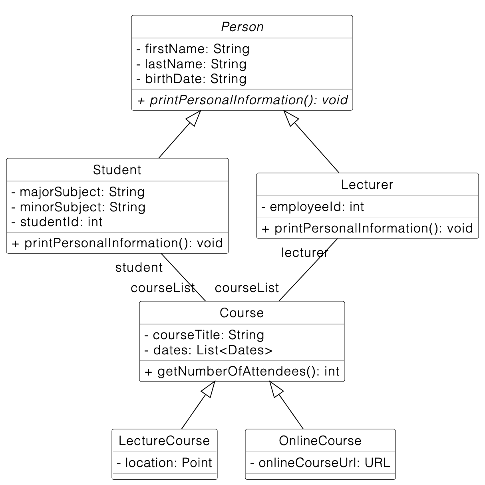

### Unit tests for the Money class
In this exercise, we want to implement unit tests for the Money class. Clone the repository and import the Maven project into your IDE.

You have the following tasks:

1. Implement the method subtract(Money) in the class Money. Implement the precondition for add(...) and subtract(...) that the currency must be identical. Throw an IllegalArgumentException if this is not the case.

2. Implement the assertion in testSimpleAdd() in MoneyTest.

3. Implement testSimpleSubtract() in MoneyTest.

4. Implement testInvalidAdd() in MoneyTest by expecting an IllegalArgumentException when the two currencies are different.

 
 ---

  

### Unit Tests for the University App 
In this exercise, we want to implement five unit tests for the University App using JUnit5.

Import the project as a Maven project in your IDE.

In case you experience problems or you have compilation errors, make sure you have installed the Java 16 JDK. If this does not help, clean the Maven cache on your computer.

__Important:__

* Please name the test methods exactly as specified in the text below! Otherwise, the automated correction of your solution will fail and you might not get full points.
* You can find the test cases in the test folder. You only need to edit source code in that folder. Annotate each test with @Test. Do not change the code in the src folder!
* Run your tests locally before you submit your changes (i.e. commit and push them). Only submit your changes, if your tests pass locally.

You have the following tasks:

1. getCourseTitle() in Course returns the title of the course object.   
Add a new test case testGetCourseTitle() in CourseTest that instantiates a Course object with a title and checks if getCourseTitle() returns the Course's title correctly.
    
2. getNumberOfAttendees() in Course returns the number of attendees of the course.  
    Add a new test case testNoAttendees() in CourseTest. It should check if getNumberOfAttendees() returns 0 if there are no attendees (or if attendees is null).  
    Add a new test case testThreeAttendees() in CourseTest. It should check if getNumberOfAttendees() returns 3 if there are three attendees.

3. setOnlineCourseUrl(String) in OnlineCourse updates the course URL with a given string. It will throw an MalformedURLException if the URL is not valid.   

    Add a new test case testSetOnlineCourseUrlWithValidUrl() in OnlineCourseTest. It should set a valid URL using setOnlineCourseUrl() and afterwards check if getOnlineCourseUrl() returns the correct URL object.     

    Add a new test case testSetOnlineCourseUrlWithInvalidUrl() in OnlineCourseTest. It should set an invalid URL using setOnlineCourseUrl() and test if the MalformedURLException is thrown.

Below you can find a UML class diagram that shows the structure of the source code you have to test. It omits getters, setters ,and constructors for simplicity reasons.

