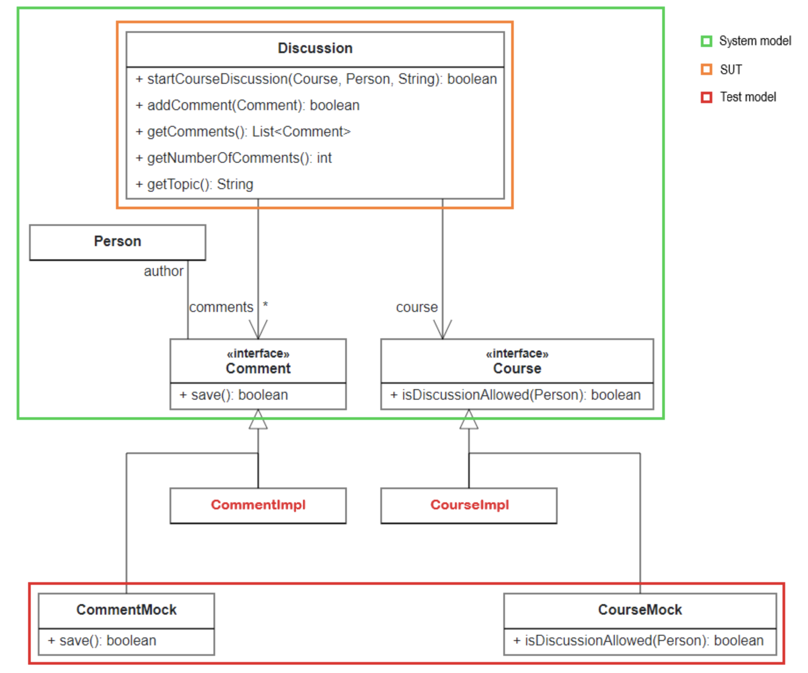
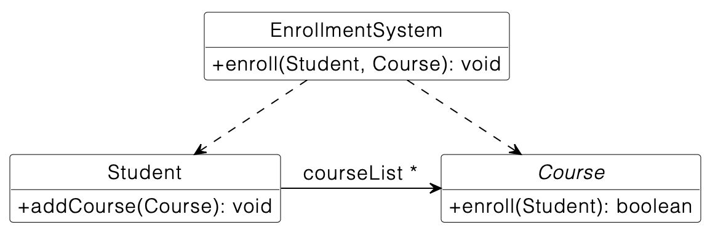

### Mock Object Pattern for Discussion
In this exercise, we want to write three unit tests to verify an existing system model. Some objects in the system model are not yet implemented and need to be mocked. The following UML diagram shows the system model (green), the SUT (orange), and the test model (red):

Write unit tests for the Discussion class (SUT). The methods in Discussion use methods of other classes (collaborating objects) such as Comment and Course, which are not yet implemented and need to be mocked. This means, that in the system model, there are already interfaces for Comment and Course, however, the actual implementations CommentImpl and CourseImpl are missing (red). We use the Java testing framework EasyMock to mock these objects. With EasyMock, we do not need to create mock classes, we can simply specify the behavior of collaborating objects by using their interfaces (in this case Comment and Course) in the test case.

Import the Maven project into your IDE. In case you experience problems, make sure you have installed the Java JDK 16.

**Important:**

* Please name the test methods exactly as specified in the text below! Otherwise, the automated correction of your solution will fail and you might not get full points.
* You can find the test cases in the test folder. Annotate tests with @Test. You only need to add and change source code here. Do not change code in the src folder!
* Run your tests locally before submitting your changes (i.e. commit and push them). Only submit your changes, if your tests pass locally.
* To verify that your test cases are implemented properly, our test system additionally injects a wrong Discussion class, i.e., a wrong SUT. In this case, your test cases must fail, otherwise, your test case is not complete.
* You can simulate this failure verification if you change the implementation of the corresponding method in Discussion, e.g., to an empty method body.
* It is helpful to provide appropriate error messages in assertions.

You have the following tasks:

1. Add a new attribute discussion of type Discussion and annotate it as test subject (SUT) using the annotation @TestSubject. Add two more attributes: courseMock of type Course and commentMock of type Comment that should be annotated with the @Mock annotation.

2. Write a test method named testComment() in DiscussionTest:   
 * Have a look at the source code of addComment(): It invokes the save() method of Comment, which is not implemented yet. 
 * As we want to test the Discussion class independently of the Comment implementation, we need to mock the Comment class.      
    * Mock the method save() of Comment, so that it always returns true using EasyMock.
 * Test if the addComment() method works as specified and if the return value of getNumberOfComments() correctly increases after addComment() was invoked.

3. Write a test method named testCommentIfSavingFails() in DiscussionTest:
 * Mock the method save() of Comment, so that it always returns false using EasyMock.
 * Test if the addComment() method works as specified and if the return value of getNumberOfComments() does not increase after addComment() was invoked.

4. Write a test method named testStartCourseDiscussion() in DiscussionTest:
 * The startCourseDiscussion() method checks if a person is allowed to start a discussion by invoking the isDiscussionAllowed() method of Course. We want you to test this method independently from the permission check.
 * Create a Person instance (either Student or Lecturer) and provide the corresponding values in the constructor call.
 * Mock isDiscussionAllowed() of Course so that it returns true for your test Person instance.
 * Test if the startCourseDiscussion() method is working as specified and if the method sets the course and the topic of the Discussion object properly.
 
 
 
 ---

  

 ### Mock Object Pattern for Ebikes
 The city of Munich wants to contribute to a sustainable environment by offering innovative, safe, and user-friendly means of transport: the PEVolve system. Riders use a mobile app on their smartphone to rent three types of personal electric vehicles (PEVs): E-Moped, E-Bikes (electronic bicycle/pedelec), and E-Kickscooter. Each PEV has internet access and reports its location regularly so that riders can locate nearby PEVs with the mobile app. Riders have to set up an online account for payment within the app before they can use it to rent a PEV or reserve it for later use. Riders may bring their own helmet to ride an E-Bike. For E-Kickscooters, the age limit is 16 and riders must bring their own helmets to be allowed to ride. An E-Moped rider needs to have a valid driver's license and may take one additional rider on the back seat. The helmets are included. You are a software engineer and part of the development team at the e-beiksters GmbH, which was contracted by the city of Munich to set up and maintain its fleet of PEVs.

#### Your Task
As a test engineer, it is your responsibility to write unit tests for 2 classes Rider and NavigationService of the system. You need to implement tests in the following test classes:

1. RiderTest
  * Test that the method rent() creates a new Rental object with correct dates and PEV. Also check, that the Rental object is added to the rentals list.
  * Test that a Rental object cannot be added to the rider's rentals list manually using the methods of the List interface.
  Hint: The test should expect an UnsupportedOperationException.
  
2. NavigationServiceTest

  There is no implementation for RealTimePositionService yet. Apply the mock object pattern using the framework EasyMock for the following tests.
  * Test that getInstructions(...) of NavigationService returns "destination reached" if the current position is equal to the destination.
  * Test that getInstructions(...) of NavigationService returns "continue" if the destination is straight ahead.
  
Notes

This exercise is provided as Maven project with source code in the src folder and test code in the test folder. All necessary dependencies and the project structure are already included.

Do not edit any of the classes in the src folder. Only change the test classes in the test folder.

 
 ---

  
 
 ### Mock Object Pattern for Enrollment
In this exercise, we want to write one unit test to verify an existing system model. The course object in the system model is not yet implemented and needs to be mocked.

Write a unit test for the Course object (SUT). There is no implementation yet, but there is already an interface for Course. The actual implementation CourseImpl is missing. We use the Java testing framework EasyMock to mock these objects. With EasyMock, we do not need to create mock classes, we can simply specify the behavior of collaborating objects by using their interfaces (in this case Course) in the test case.

#### Important:

* Import the project as a Maven project.
* You can find the test in the test folder. You only need to edit the source code in the test folder. Do not change the code in the src folder!
* Run your tests locally before you submit your changes. Only submit your changes if your tests pass locally.
* To verify that your tests are implemented properly, our test system additionally injects a wrong Student class, i.e., a wrong system model. In this case, your test case must fail, otherwise your test case is not complete.
* You can simulate this failure verification if you change the implementation of the method addCourse(...) in Student, e.g., to an empty method body.

You have the following tasks:

1. Setup the EnrollmentServiceTest class following the Mock Object Pattern as discussed in the Lecture. Add the attributes enrollmentService and courseMock and annotate them accordingly.

2. Write a test method named testEnrollStudentSuccessful() in EnrollmentServiceTest

Hint: Take a look at the slides in Lecture 08 to see how you can run JUnit tests with Eclipse. You can find the test class in the folder test. Remember to add useful annotations!

Optional challenge:

Also write another test testEnrollStudentFailure() in which the registration fails, because the method enroll(Student): boolean of the Course mock returns false. This method is not tested.